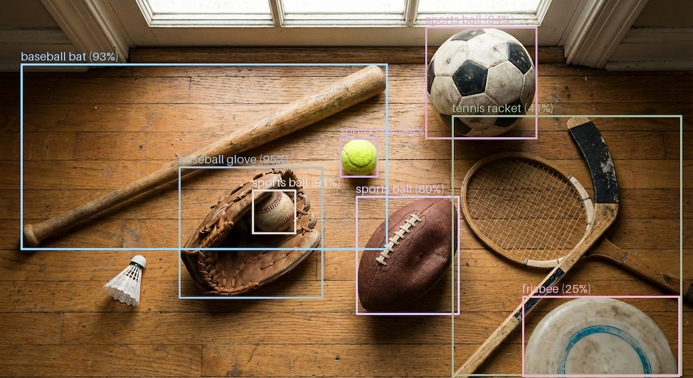

# Real-Time Object Detection with RF-DETR and Amazon SageMaker

Learn how to deploy and performance test the state-of-the-art RF-DETR object detection model to Amazon SageMaker using PyTorch for production-ready, real-time inference with GPU acceleration.




## Features

- Uses pre-trained RF-DETR-Large model with COCO labels
- Creates SageMaker-compatible model artifact
- Deploys real-time endpoint with GPU acceleration
- Custom PyTorch inference handler
- Supports images and video
- Includes performance testing with [Locust](https://locust.io/)
- Local inference support for image and video detection (No AWS required)
- Instance segmentation with RF-DETR Seg Preview model

## Contents

- `deploy_rf_detr.ipynb` - End-to-end deployment notebook
- `code/` - SageMaker model code directory
  - `inference.py` - Custom SageMaker inference handler for RF-DETR
  - `requirements.txt` - Python dependencies
- `local_inference/` - Local inference scripts
  - `object_detection_image.py` - Image detection with segmentation and annotation options
  - `object_detection_video.py` - Video detection with RF-DETR models
- `sample_images/` - Sample images for testing
- `locust_scripts/` - Performance testing scripts
- `previews/` - Sample detection results

## Prerequisites

- AWS account with SageMaker access
- Python 3.12+
- Jupyter notebook environment

## Environment Variables

Configure the RF-DETR model using these environment variables when deploying to SageMaker:

- `RFDETR_MODEL` - Model checkpoint filename (default: "rf-detr-large.pth")
- `RFDETR_MODEL_TYPE` - Model variant: rfdetr-nano, rfdetr-small, rfdetr-medium, rfdetr-base, rfdetr-large (default: "rfdetr-large")
- `RFDETR_LABELS` - Label set to use (default: "coco")
- `RFDETR_CONF` - Confidence threshold 0.0-1.0 (default: "0.25")
- `RFDETR_RESOLUTION` - Input resolution, must be divisible by 56 (optional)
- `RFDETR_OPTIMIZE` - Enable inference optimization for 3-5x speedup (default: "true")
- `RFDETR_COMPILE` - Enable torch.jit.trace compilation (default: "true")

## Usage

### SageMaker Deployment

1. Proceed to your Amazon SageMaker Studio space
2. `git clone` this repository to your Studio environment
3. Run the Jupyter notebook [deploy_rf_detr.ipynb](deploy_rf_detr.ipynb)
   - Uses `rf-detr-large.pth` model checkpoint
   - Packages model artifact with inference code
   - Deploys to SageMaker real-time endpoint
   - Tests object detection on sample images
4. Optionally, use [Locust](https://locust.io/) to load test your endpoint (see [README.md](locust_scripts/README.md))

### Local Inference (Without AWS/SageMaker)

For local testing without deploying to SageMaker:

**Image Detection:**

```bash
python local_inference/object_detection_image.py
```

Demonstrates image segmentation using RF-DETR Seg Preview model with multiple annotation styles (masks, boxes, labels, outlines).

**Video Detection:**

```bash
python local_inference/object_detection_video.py
```

Processes video files with object detection using RF-DETR models (base/medium/large).

Available model checkpoints: `rf-detr-base.pth`, `rf-detr-medium.pth`, `rf-detr-large.pth`, `rf-detr-seg-preview.pt`

## Install Requirements (Mac with `pip`)

```bash
brew install python@3.12

python3.12 -m pip install virtualenv --break-system-packages -Uq
python3.12 -m venv .venv
source .venv/bin/activate

python3.12 -m pip install -r ./requirements.txt -Uq
```

## License

This project is licensed under the MIT License. See the [LICENSE](LICENSE) file for details.

## Disclaimer

The contents of this repository represent my viewpoints and not those of my past or current employers, including Amazon Web Services (AWS). All third-party libraries, modules, plugins, and SDKs are the property of their respective owners.
